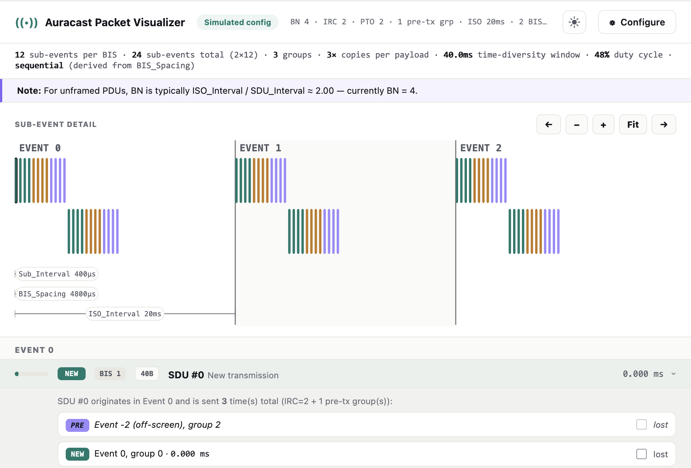

# Auracast Packet Visualizer

> [!NOTE]
> This project was developed with heavy LLM usage. It's essentially just rendering packets with lots of HTML/CSS/JS. It does work well, and results were verified with actual sniffed packet captures.



This is a visualizer for Auracast, or BIS (Broadcast Isochronous Stream) packets and packet captures. Because the arrangement and layouts of these packets over the air can become quite complex, a rendering of these can be quite helpful.

It operates in two modes:

- **Simulation:** Allows tweaking BIS properties to see how this affects packet number, layout and timing.
- **Capture:** Load a sniffed BIS packet capture. This will show the full capture and render the packet layout with some additional information (e.g., missing packets).

The *capture mode* requires a `.pcapng` file with raw LE LL packets. You can use the sniffer in [Auracast Hacker's Toolkit](https://github.com/auracast-research/auracast-hackers-toolkit) to get such a packet capture. Press *Configure* to load a PCAP.

## Build & Run

This builds to a single HTML file that can be opened, or served via the dev server.

```
npm install
npm run dev         # local dev server with hot reload
npm run build       # writes the single-file dist/index.html
```
